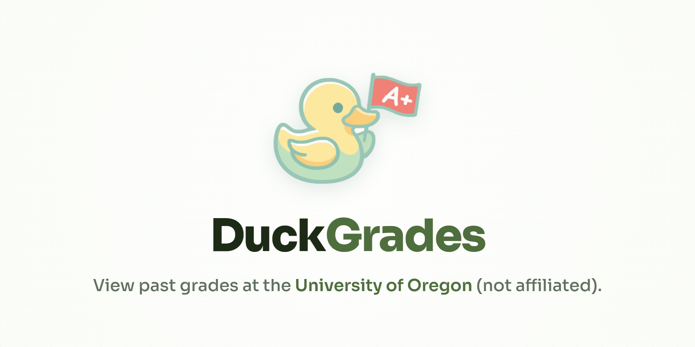

# DuckGrades

<p align="center">
  <a href="https://duckgrades.maarv.dev">
    
  </a>
</p>

<p align="center">
  <a href="https://duckgrades.maarv.dev"><strong>→ duckgrades.maarv.dev</strong></a>
</p>

DuckGrades is a fast, lightweight web application that helps you explore University of Oregon grade distributions and statistics by subject, course, and professor.

## Features

- **Search:** Quickly find courses, professors, or subjects.
- **Analytics Dashboard:** Compare how grades shift over time, by course level, by subject, and by class size.
- **Browse Subjects:** Look through all available subjects and view their historical grade distributions.
- **Data Visualizations:** Interactive charts and graphs for grade distributions and historical trends.
- **Theming:** Built-in support for light and dark modes.

## Tech Stack

- **Framework:** React + Vite
- **Language:** TypeScript
- **Styling:** Tailwind CSS
- **Runtime:** Bun
- **Routing:** React Router
- **Charts:** uPlot
- **Icons:** Lucide React

## Getting Started

1. **Install dependencies:**

   ```bash
   bun install
   ```

2. **Run the development server:**

   ```bash
   bun run dev
   ```

   Open the application in your browser (typically `http://localhost:5173/`).

3. **Build the application:**
   ```bash
   bun run build:all
   ```
   _(This builds data, generates the sitemap, builds the UI, and copies static assets into the dist folder)._

<!-- ## Project Goal

To maintain DuckGrades as an efficient, static-friendly site that remains free to host on platforms like GitHub Pages and Cloudflare Pages long-term. -->

## Hosting

The project is a static website where all the computation is performed during build. We then host the website via Cloudflare Pages so it can remain public and free forever.

## Updating

The information is obtained via the university via FOIA request. This website may be updated if someone requests the university for updated information and contributes the data.
